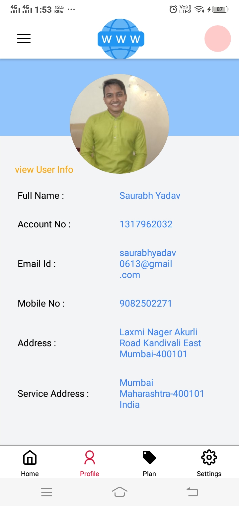

# Solera Life Science Pvt.ltd

# SuperSlot React Native Coding Test

 

 
 

## To Run The App On Your Phone Screen

First Download expo go App on your phone than copay the link ![()] and peast
on expo go app Url section.

## 1. Make sure you have NODE installed!

Firstly, you will need to download the latest version of Node by <a href="https://nodejs.org/en/download/">CLICKING HERE</a>

## 2. Install Dependancies

Next, you need to install all the dependancies using:

`npm install`

Once this is done, you can start the app with:

`expo start`

## 3. (OPTIONAL) Replacing images and/or fonts

If you want to display your own pictures then you have to replace the code.
